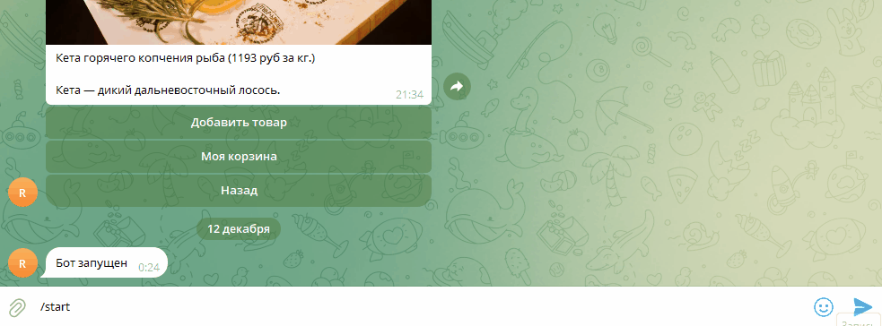

# Магазин рыбы!
Бот в телеграмм для продажи рыбы, основан на strapi
   
Пример использования:



## Быстрый доступ
- tg - [Нажмите /start](https://t.me/redkrayn_fish_bot)

## Установка зависимостей

Убедитесь, что у вас установлен Python 3.7 или выше, затем выполните:
```
pip install -r requirements.txt
```

## Установка Redis
1. Скачайте Redis с [официального сайта](https://redis.io/docs/latest/operate/oss_and_stack/install/install-redis/install-redis-on-windows/)

2. Запустите `redis-server.exe`

## Запуск Strapi
1. Разархивируйте файл `redkrayn_fish_shop.rar`
2. `cd /redkrayn_fish_shop` - перейдите в папку
3. `npm run develop`

## Настройка переменных окружения
`STRAPI_TOKEN` - Гайд для получения токена [здесь](https://docs.strapi.io/cms/features/api-tokens#usage)

`TELEGRAM_BOT_TOKEN` - Для начала создайте бота в [телеграме](https://telegram.me/BotFather), после вам выдадут токен.

`TELEGRAM_CHAT_ID` - Укажите ваш чат айди, узнать его можно написав боту [@userinfobot](https://telegram.me/userinfobot).

`REDIS_HOST` - Укажите хост, по дефлоту локальный

`REDIS_PORT` - Укажите порт, по дефолту 6379

`REDIS_PASSWORD` - Укажите пароль, если требуется, по дефолту нет

`REDIS_DB` - Укажите бд, по дефолту 0

## Запуск бота
```
python tg_shop_bot.py
```
 
## Цели проекта
Код написан в учебных целях — это урок в курсе по Python и веб-разработке на сайте [Devman](https://dvmn.org).
